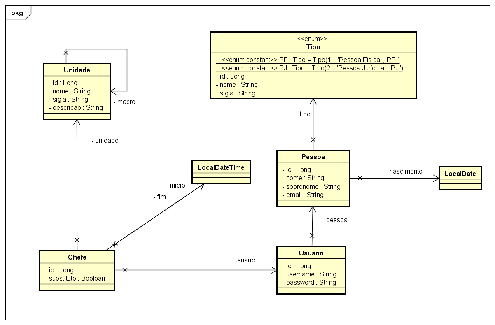
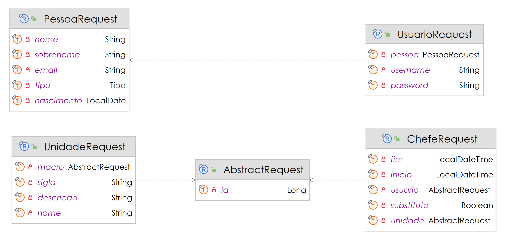
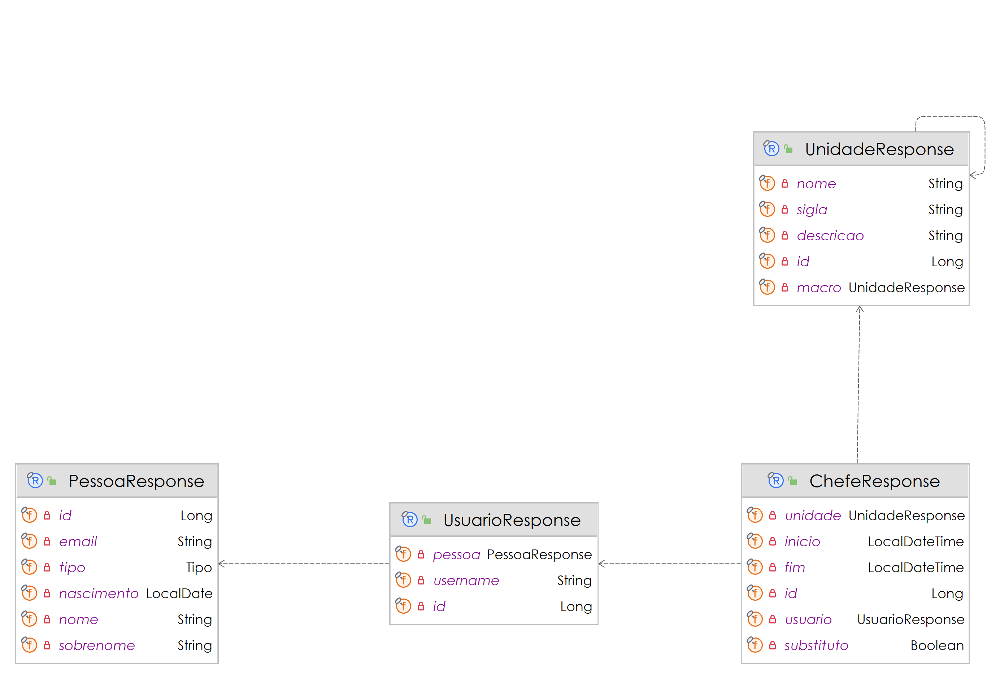

# Gestão das Unidades da Holding - Projeto da Faculdade

# Sumário

[Estudo de caso ](#_Estudo_de_caso)

[Diagrama de Classes ](#_Diagrama_de_Classes)

# Estudo de caso

Administrar empresas de grande porte não é tarefa trivial. Neste sentido, a estruturação organizacional é tarefa fundamental para a gestão das operações empresariais da Holding Benezinho.

O conglomerado empresarial está interessado em reestruturar seus departamentos com o objetivo de melhorar o gerenciamento da segurança, de liberação de acessos aos sistemas e melhor realocação de pessoal.
Este investimento pode oferecer diversas vantagens para o empresário e para os colaboradores, pois com o atual cenário de trabalho remoto, equipes menores e bem gerenciadas podem trazer resultados significativos.

Com o objetivo de fazer este negócio dar certo, idealizamos o desenvolvimento de um Sistema de Gestão de Unidades da empresa.

Criaremos, nesta atividade, um Produto Mínimo Viável (PMV) de uma API Rest para este sistema.

Nossa equipe de analistas desenvolveu o Diagrama de Classes abaixo, e a sua missão aqui é realizar o Mapeamento Objeto Relacional das classes de Entidade. Usaremos a JPA e o Hibernate como ferramentas de Mapeamento Objeto Relacional.

Na sprint atual, você foi incumbido de fazer:

1. O Mapeamento Objeto Relacional das primeiras classes envolvidas neste projeto de software;

2. A criação automatizada das tabelas no banco de dados Oracle;

3. A persistência de todos os dados, e;

4. A criação dos Seguintes Repositorios :

    1. ChefeRepository
    2. PessoaRepository
    3. UnidadeRepository
    4. UsuarioRepository

5. A criação dos Seguintes Resources que devem implementar a ResourceDTO (foi fornecida):

    1. **ChefeResource** com as seguintes ROTAS e VERBOS:

        1. "localhost/chefe" - **GET**, **POST**
        2. "logalhost/chefe/{id}" - **GET**

    2. **UnidadeResource** com as seguintes ROTAS e VERBOS:
        1. "localhost/unidade" - **GET**, **POST**
        2. "logalhost/unidade/{id}" - **GET**
    3. **UsuarioResource** com as seguintes ROTAS e VERBOS:
        1. "localhost/usuario" - **GET**, **POST**
        2. "logalhost/usuario/{id}" - **GET**

6. A criação dos Seguintes Services que devem implementar a ServiceDTO (foi fornecida):

    1. **ChefeService**
    2. **PessoaService**
    3. **UnidadeService**
    4. **UsuarioService**

7. A criação dos Seguintes DTOs (Objetos de Transferência de Dados) de Request e de Response respeitando os Diagramas de Classe Fornecidos:

    1. **ChefeRequest** e **ChefeResponse**
    2. **PessoaRequest** e **PessoaResponse**
    3. **UnidadeRequest** e **UnidadeResponse**
    4. **UsuarioRequest** e **UsuarioResponse**
    5. **AbstractRequest**

# Diagrama de Classes de Entidade

# Diagrama de Classes de Request

# Diagrama de Classes de Response

